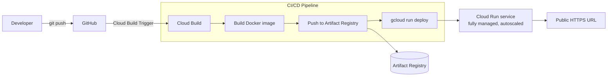

# CI/CD → Cloud Run

The simplest project in the series: a containerized Flask app, built and deployed straight to **Cloud Run** by **Cloud Build** on every push — no Kubernetes, no Terraform, no cluster to manage. This is the fastest possible path from `git push` to a running, public HTTPS URL on GCP.

Where the other projects in this series explore GKE, Jenkins, and Infrastructure as Code, this one is deliberately the opposite end of the spectrum: a fully serverless deployment target, useful as a baseline for comparison and as the quickest thing to stand up from scratch.

---

## Architecture



**Flow summary:**
1. A push to the connected GitHub repository fires a Cloud Build Trigger.
2. Cloud Build builds the Docker image and tags it with the commit's short SHA.
3. The image is pushed to Artifact Registry.
4. Cloud Build runs `gcloud run deploy`, pointing the Cloud Run service at the freshly pushed image — Cloud Run handles revisions, autoscaling (including to zero), and traffic routing automatically.
5. The service is reachable over HTTPS immediately, with no load balancer, ingress, or cluster to configure.

---

## Tech stack

| Layer | Technology |
|---|---|
| Application | Python 3.11, Flask |
| Containerization | Docker |
| CI/CD | Google Cloud Build (trigger-based) |
| Compute | Cloud Run (fully managed, serverless) |
| Registry | Google Artifact Registry |

---

## Repository structure

```
.
├── main.py             # Flask app ("/")
├── Dockerfile
├── requirements.txt     # flask
├── cloudbuild.yaml       # Build → push → deploy pipeline definition
└── LICENSE
```

---

## Getting started

### Prerequisites
- A GCP project with billing enabled
- Cloud Build, Artifact Registry, and Cloud Run APIs enabled
- The GitHub repository connected to Cloud Build via a Trigger

### 1. Create the Artifact Registry repository
```bash
gcloud artifacts repositories create my-repo \
  --repository-format=docker \
  --location=europe-central2
```

### 2. Configure the Cloud Build Trigger
Connect this repository in Cloud Build and point the trigger at `cloudbuild.yaml`. Make sure the Cloud Build service account has the `roles/run.admin` and `roles/iam.serviceAccountUser` roles so it's allowed to deploy to Cloud Run.

### 3. Push to trigger a deploy
```bash
git push
```
Cloud Build builds the image, tags it with the commit SHA, pushes it to Artifact Registry, and deploys it to Cloud Run — no manual `kubectl` or infrastructure step required, since Cloud Run itself is the infrastructure.

### 4. Verify
```bash
gcloud run services describe my-app \
  --region=europe-central2 \
  --format='value(status.url)'

curl <SERVICE_URL>
```

---

## Design decisions & known limitations

Kept intentionally minimal to isolate exactly what a Cloud Run-based pipeline needs — no cluster, no manifests, no autoscaling config to write by hand:

- **`--allow-unauthenticated` makes the service public with no auth layer.** That's the point for a demo you want to `curl` immediately, but a real deployment would either put it behind IAP/an authenticated invoker, or require the caller to send an identity token.
- **The Cloud Build service account isn't scoped explicitly in this repo** — it relies on whatever roles are already granted to the default Cloud Build service account in the project. A more careful setup would use a dedicated, least-privilege service account for the `run.admin` deploy step.
- **No health endpoint beyond `/`** — Cloud Run's own startup/liveness checks rely on the container serving on the configured port, but there's no dedicated `/health` route to distinguish "process is up" from "app is actually ready."
- **No image scanning, no automated tests** in the pipeline.
- **Single environment** — every push deploys straight to the one Cloud Run service; no staging revision or traffic-splitting is used, even though Cloud Run supports both natively.

## Skills demonstrated

GCP-native CI/CD (Cloud Build Triggers) · serverless deployment (Cloud Run, autoscaling-to-zero) · container image tagging by commit SHA · Artifact Registry · IAM roles for automated deployment (`run.admin`, `iam.serviceAccountUser`) · picking the right compute target for the job (serverless vs. Kubernetes) rather than defaulting to the same tool every time.
